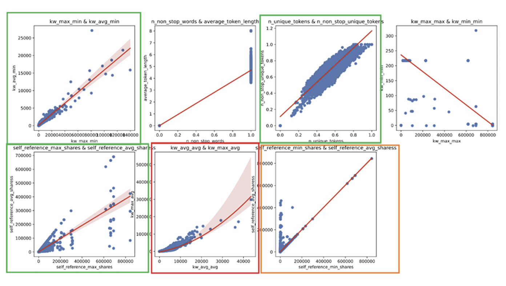
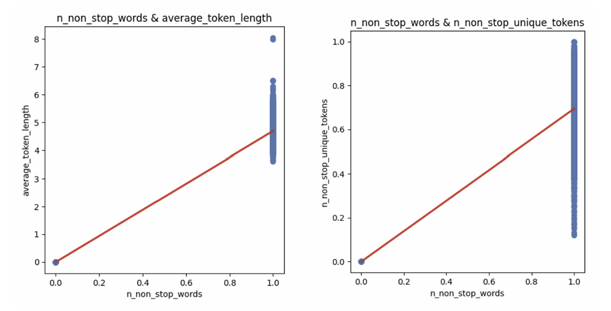
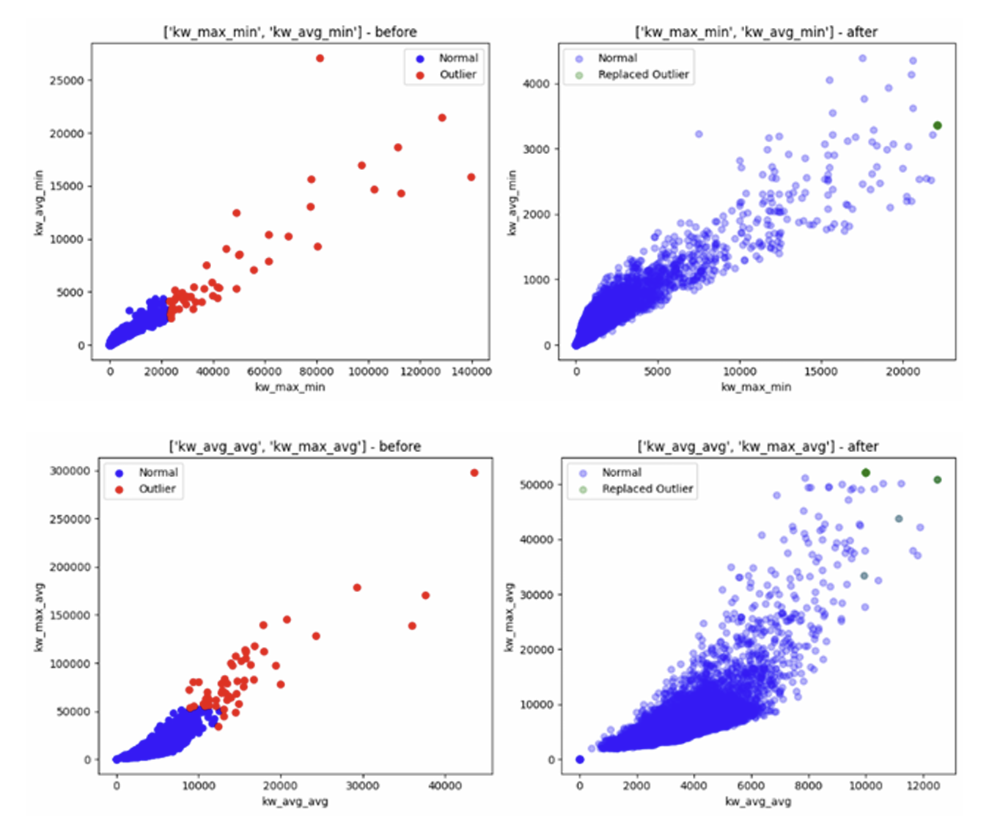

# 📰 Online News Popularity Prediction
> **Selected as an Outstanding Project** in the Pattern Recognition course at Ewha Womans University.

This project focuses on predicting the "virality" of online news articles (whether an article exceeds 1,400 shares) by analyzing various features of the content. Our team achieved high predictive performance through advanced data preprocessing and ensemble modeling.

## 🏆 Achievement
- **Selected as a Top Project**: Recognized for excellence in methodology and analysis within the Pattern Recognition course, followed by an official class presentation.

## 👥 Team Members (Team 5)
- Doyoon Kim, Minha Woo, Yeeun Kim, Jiwon Lee

### 👤 My Contributions (Jiwon Lee)
I led the critical data preprocessing logic and final model optimization to ensure robust performance.

#### **1. Sophisticated Data Imputation Strategy**
**Logic Design**: Developed the entire missing value handling hierarchy based on statistical analysis.
**Regression Imputation**: Implemented Linear and Polynomial regression to fill missing values for highly correlated variable pairs ($r > 0.7$).

**Triple-Variable Dependency Analysis**: Analyzed complex conditional relationships between `n_non_stop_words`, `n_non_stop_unique_tokens`, and `average_token_length` to derive custom imputation logic.

**Skewness-based Filling**: Applied mean/median imputation selectively based on the skewness of variables without strong correlations.

#### **2. Advanced Outlier Management**
**DBSCAN Clustering**: Conducted density-based outlier detection using scatterplots of highly correlated variables to replace anomalies with the nearest normal points. 

**Quantile Approach**: Replaced the naive IQR method with a 5%/95% Quantile-based clipping strategy after analyzing skewed data distributions.

#### **3. Model Tuning & Optimization**
**Individual Model Tuning**: Executed a three-stage optimization (Randomized Search → Grid Search → Bayesian Optimization) for Decision Tree and Random Forest models.
**Stacking Ensemble & Meta-Tuning**: Developed and manually tuned a Stacking model using CatBoost, Random Forest, and XGBoost as base models with a Logistic Regression meta-model. 
**Final Threshold Optimization**: Performed threshold tuning (range 0.40–0.60) to find the optimal cutoff (0.44), resulting in a final Mean Score of 0.6955.

## 🎯 Project Objective
- **Goal**: Build a binary classification model to predict news popularity.
- **Target Variable**: `y=1` (Popular, >1,400 shares), `y=0` (Not popular)
- **Dataset**: 22,200 samples with 46 features (approx. 10% missing values).

## 🛠️ Key Workflow & Technical Strengths

### 1. Advanced Data Preprocessing
- **Regression-based Imputation**: Instead of simple mean/median filling, we performed **Linear/Polynomial Regression** to impute missing values for highly correlated variable pairs (r > 0.7).
- **Outlier Handling with DBSCAN**: Utilized **Density-Based Spatial Clustering (DBSCAN)** to identify and handle outliers in high-dimensional spaces, improving model robustness.
- **Feature Engineering**: Applied **Log Transformation** to skewed numerical data and utilized **StandardScaler** for normalization.

### 2. Modeling & Evaluation
- **Algorithm Exploration**: Evaluated multiple models including Logistic Regression, Random Forest, XGBoost, CatBoost, and LightGBM.
- **Final Model**: Developed a **Stacking Ensemble** (Meta Model: Logistic Regression) to maximize predictive accuracy.
- **Performance**: Achieved a final **Mean Score of 0.6955**.

## 📂 Project Structure
- **[FINAL CODES](./FINAL%20CODES)**: Final Python source code for preprocessing and modeling (`code.ipynb`).
- **[REPORTS](./REPORTS)**: Detailed project report and presentation slides (`report.pdf`, `PPT.pdf`).
